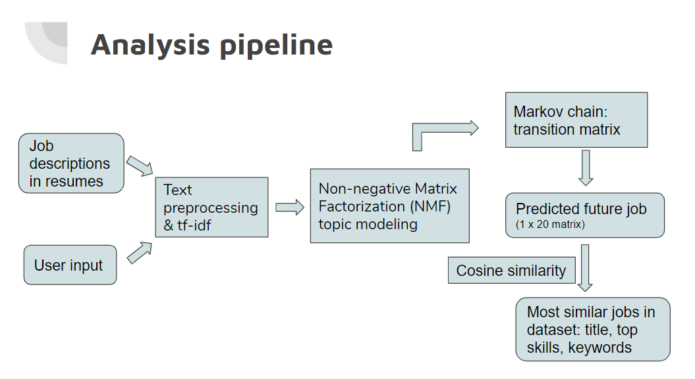

## What's your next job?

### Project motivation
A web app I developed as my Insight project. The motivation of the project is that job transitions are often stressful; it can be hard to figure out what next job might be good for you. I made a web app that provides users with personalized information about potential future jobs and skills important for such jobs. 

### Methodology
__Data__: to look at job transitions that have actually occurred, I used job experiences listed in resumes, which list job experiences in chronological order.
 __Analysis pipeline__: the following is a snapshot of my analysis pipeline.

* After preprocessing and vectorizing job descriptions in resumes, NMF topic modeling is used to extract topics from each job description. Topics can be considered skills involved in different jobs.
* Markov chain is used to model changes in dominant topics/skills as job transitions occur. A transition matrix, probability of transitioning from each topic/skill at a current job to each topic/skill at the subsequent job.
* User input (brief description of current job) is processed in the same way as job descriptions in the dataset. Future job is predicted by multiplying topic matrix of user's current job and the transition matrix.
* Cosine similarity is used to find jobs in the dataset that are most similar to the predicted future job (both of which are represented as vectors). Information about those most similar jobs including job title, key skills, and key words are retrieved and presented to user.

## Files
__resume_scraping__: scrapes resumes (work experience and education) from indeed.ca. For this project, only data science/analytics/enginerring related jobs are scraped.
 __data_preprocessing__: cleans and wrangles scraped data.
 __topic_modeling__: pocesses text (job descriptions) and runs nmf topic modeling. A word2vec model is trained to represent words in the dataset as vectors; semantic similarity between words is then used to compute coherence score for topic model seletion.
 __transition_matrix__: computes probability of transitionsing from each topic at a current job to each topic at the subsequent job. 
 __next_job_pipeline__: processes user input and extracts its topics, calculates predicted future job, find jobs in dataset that are most similar to the predicted future job and retrieve information about those jobs.
